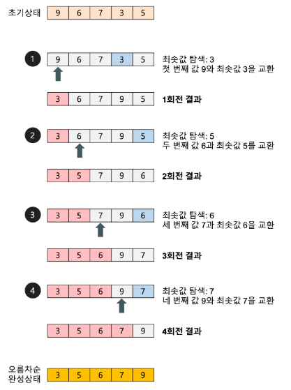

 
  
## 선택 정렬(selection sort) 알고리즘 개념 요약

**[권희정님의 블로그](https://gmlwjd9405.github.io/2018/05/06/algorithm-selection-sort.html) 그림 참고**

   

- 과정 설명   

 1. n개의 정렬할 요소가 들어 있는 리스트가 있다고 가정한다. 
 2. 전체의 요소 중에 가장 작은 값을 찾아 첫 번째 칸과 교체한다.  
 3. 첫 번째 칸은 정렬 되었기에 두 번째 부터 n번째 요소를 1~2번 과정을 반복한다.  
 
- 코드적 해석   

 1. n개의 칸에 대해 실행을 하기에 n번의 반복문을 돈다. (N번)  
 2. 각 반복에서 고려할 리스트의 요소 수는 하나씩 줄어든다. (N개, N-1개, ... ,2개, 1개)  
 3. n번의 각 반복 안에서 고려하는 리스트에서 최소 값을 찾아 첫번쨰 요소와 교환을 해야한다. (N번, N-1번, ... ,2번, 1번)  

 

 

### 시간복잡도
 - T(n) = (n-1) + (n-2) + ... + 2 + 1 = n(n-1)/2 = O(n^2)
