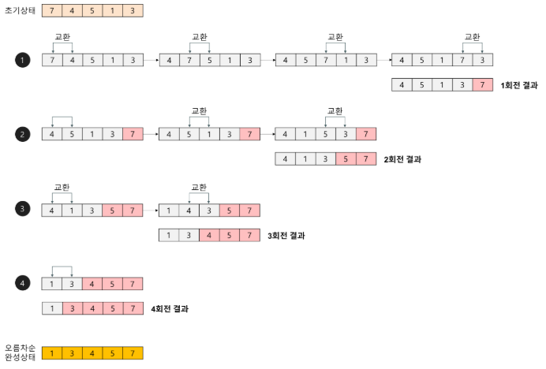

 
  
## 버블 정렬(bubble sort) 알고리즘 개념 요약

**[권희정님의 블로그](https://gmlwjd9405.github.io/2018/05/06/algorithm-bubble-sort.html) 그림 참고**

   

- 과정 설명   

 1. n 개의 정렬할 요소가 들어 있는 리스트가 있다고 가정한다. 
 2. 리스트의 1번째 요소와 2번째 요소를 비교하여 1번째 요소가 더 크다면 스왑한다.
 3. 리스트의 2번째 요소와 3번째 요소를 비교하여 2번째 요소가 더 크다면 스왑한다.
 4. 2, 3의 과정과 같이 n-1번째 요소와 n번째 요소를 비교하여 스왑할 때 까지 반복한다.
 5. n번째 요소는 가장 큰 값이 들어갔기에 1~4 과정을 반복하면서 다시 1번째 요소부터 정렬 전 요소까지 비교한다.
 
- 시간 복잡도 해석   

 1. n개의 칸에 대해 실행을 하기에 n번의 반복문을 돈다. (N번)  
 2. 각 반복에서 고려할 리스트의 요소 수는 하나씩 줄어든다. (N개, N-1개, ... ,2개)  
 3. n번의 각 반복 안에서 고려하는 리스트에서 인접한 요소끼리 교환을 해야한다. (N번, N-1번, ... ,2번, 2번)  
 4. 참고) 교환이 매우 빈번하게 일어나기에 정렬중에 속도는 가장 느리다.
 5. 참고)최악의 경우는 역순으로 정렬된 경우 교환이 계속 일어나고 최상의 경우 이미 정렬된 경우로 교환이 일어나지 않는다.
 

 

### 시간복잡도
 - T(n) = (n-1) + (n-2) + ... + 2 + 1 = n(n-1)/2 = O(n^2)
