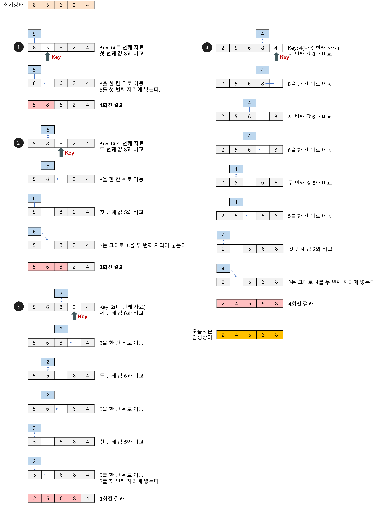

 
  
## 삽입 정렬(insertion sort) 알고리즘 개념 요약

**[권희정님의 블로그](https://gmlwjd9405.github.io/2018/05/06/algorithm-insertion-sort.html) 그림 참고**

   
- 전제 
    - 현재 보고 있는(key) 값 전의 요소는 모두 정렬이 됐다고 가정한다.  
    
- 과정 설명   
 
 1. n 개의 정렬할 요소가 들어 있는 리스트가 있다고 가정한다. 
 2. 리스트의 2번째 요소를 기준값으로 지정한다. 기준 값보다 1번째 요소가 더 크다면 2번째 요소의 위치로 옮긴다.
 3. 리스트의 3번째 요소를 기준값으로 지정한다. 기준 값보다 2번째 요소가 더 크다면 3번째 요소의 위치로 옮기고 기준 값보다 1번째 요소가 더 크다면 2번째 요소의 위치로 옮긴다.
 4. 2, 3의 과정과 같이 n번째 요소를 기준 값으로 n-1번째부터 1번째 요소와 비교하며 기준 값보다 크면 한 칸씩 뒤로 미루고 크지 않는 값이 나오면 다음 요소를 key값으로 삼는다.
  
- 시간 복잡도 해석   

 1. n개의 칸에 대해 실행을 하기에 n번의 반복문을 돈다. (N번)  
 2. 각 반복에서 고려할 리스트의 요소 수는 하나씩 줄어든다. (N개, N-1개, ... ,2개)  
 3. n번의 각 반복 안에서 고려하는 리스트에서 인접한 요소끼리 교환을 해야한다. (N번, N-1번, ... ,2번, 2번)  
 4. 참고) 교환이 매우 빈번하게 일어나기에 정렬중에 속도는 가장 느리다.
 5. 참고)최악의 경우는 역순으로 정렬된 경우 교환이 계속 일어나고 최상의 경우 이미 정렬된 경우로 교환이 일어나지 않는다.
 

 

### 시간복잡도

- 최선의 경우
	- 비교 횟수
		- 이동 없이 1번의 비교만 이루어진다.
		- 외부 루프: (n-1)번
	- Best T(n) = O(n)
- 최악의 경우(입력 자료가 역순일 경우)
	- 비교 횟수
		- 외부 루프 안의 각 반복마다 i번의 비교 수행
		- 외부 루프: (n-1) + (n-2) + … + 2 + 1 = n(n-1)/2 = O(n^2)
	- 교환 횟수
		- 외부 루프의 각 단계마다 (i+2)번의 이동 발생
		-n(n-1)/2 + 2(n-1) = (n^2+3n-4)/2 = O(n^2)
	- Worst T(n) = O(n^2) 

대체로 O(n^2)인 삽입정렬, 버블정렬, 선택정렬 중 가장 빠르다.